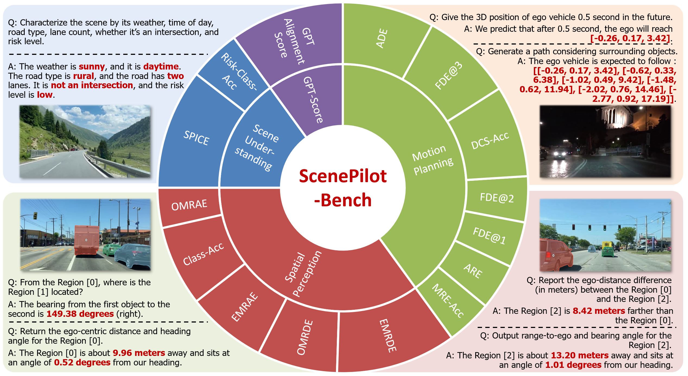

# **ScenePilot-4K: A Large-Scale First-Person Dataset and Benchmark for Vision-Language Models in Autonomous Driving**
<div align="center">
  
  <p>Figure 1: Overview of the ScenePilot-Bench benchmark and evaluation metrics.</p>
</div>


[](https://github.com/yjwangtj/ScenePilot-Bench)
[](https://huggingface.co/datasets/larswangtj/ScenePilot-4K/tree/main) 
[](https://arxiv.org/abs/2601.19582)
[](https://drive.google.com/file/d/14CisDMqTLfFrd8PADajuL0TNR5V90BSr/view?usp=drive_link)

# 📖 Introduction
We introduce ScenePilot-4K, a large-scale first-person driving dataset for safety-aware vision-language learning and evaluation in autonomous driving. Built from public online driving videos, ScenePilot-4K contains 3,847 hours of video and 27.7M front-view frames spanning 63 countries/regions and 1,210 cities. It jointly provides scene-level natural-language descriptions, risk assessment labels, key-participant annotations, ego trajectories, and camera parameters through a unified multi-stage annotation pipeline. Building on this dataset, we establish ScenePilot-Bench, a standardized benchmark that evaluates vision-language models along four complementary axes: scene understanding, spatial perception, motion planning, and GPT-based semantic alignment. The benchmark includes fine-grained metrics and geographic generalization settings that expose model robustness under cross-region and cross-traffic domain shifts. Baseline results on representative open-source and proprietary vision-language models show that current models remain competitive in high-level scene semantics but still exhibit substantial limitations in geometry-aware perception and planning-oriented reasoning.

# 📄 Supplementary Material
The supplementary material is now publicly available and includes additional details on the dataset construction pipeline, benchmark design, evaluation metrics, etc.

👉 **Access the supplementary material here:**  
[Supplementary Material (PDF)](https://drive.google.com/file/d/14CisDMqTLfFrd8PADajuL0TNR5V90BSr/view?usp=drive_link)

# 🛠️ Installation

```bash
# 1. Clone the repository
git clone https://github.com/yjwangtj/ScenePilot-Bench.git
cd ScenePilot-Bench

# 2. Create and activate a Conda environment
conda create -n scenepilot python=3.10 -y
conda activate scenepilot

# 3. Install required dependencies

pip install -r requirements.txt
```

# 🚀 Inference

```bash
# 1. Load Model & Processor
import torch
import requests
from PIL import Image
from io import BytesIO
from transformers import AutoProcessor, AutoModelForImageTextToText
from qwen_vl_utils import process_vision_info

# 1. Load Model & Processor
# Replace with your local model weight directory
model_path = "path/to/ScenePilot_model" 
model = AutoModelForImageTextToText.from_pretrained(
    model_path, 
    torch_dtype=torch.bfloat16, 
    device_map="auto", 
    trust_remote_code=True
)
processor = AutoProcessor.from_pretrained(model_path, trust_remote_code=True)

# 2. Prepare Input
# You can replace this URL with a local image path: Image.open("your_image.jpg")
url = "https://raw.githubusercontent.com/yjwangtj/ScenePilot-Bench/main/assets/sample_drive.jpg"
image = Image.open(BytesIO(requests.get(url).content)).convert("RGB")

# Define Autonomous Driving VQA Prompt
prompt = "Report the current weather, time, road type, how many lanes, if it’s an intersection, and the risk level."

messages = [
    {
        "role": "user",
        "content": [
            {"type": "image", "image": image},
            {"type": "text", "text": prompt}
        ]
    }
]

text_prompt = processor.apply_chat_template(messages, tokenize=False, add_generation_prompt=True)
image_inputs, _ = process_vision_info(messages)
inputs = processor(
    text=[text_prompt], 
    images=image_inputs, 
    return_tensors="pt"
).to(model.device)

# Generate  response
output_ids = model.generate(**inputs, max_new_tokens=128)
answer = processor.batch_decode(
    output_ids[:, inputs.input_ids.shape[1]:], 
    skip_special_tokens=True
)[0]

print(f"--- ScenePilot Result ---\n{answer}")
```


# 📊ScenePilot Benchmark

This repository provides a **two-step evaluation pipeline** for benchmarking Vision-Language Models (VLMs) on the ScenePilot-Bench dataset.


## Step 1: Scene Graph Parsing

Use `scene_graph_parser_final-all.py` to parse **model-generated answers** into a standardized **scene semantic graph representation**.
The parsed results will be saved as a JSON file, which serves as the input for the benchmark scoring stage.

```bash
python scene_graph_parser_final-all.py \
    --input_path path/to/model_outputs.json \
    --output_path path/to/parsed_scene_graph.json
```

**Output**

* A JSON file containing structured scene graph representations extracted from model predictions.


## Step 2: Benchmark Scoring

Use `benchmark_score_final-all.py` to compute **evaluation metrics and final benchmark scores** based on the parsed scene graphs.

```bash
python benchmark_score_final-all.py \
    --input_path path/to/parsed_scene_graph.json \
    --output_dir path/to/save_results
```

Before running the script, please ensure the following paths are properly configured inside the code or via arguments:

* **GPT output log path** (optional, can be commented out if not required)
* **Normalization parameters JSON file**, used for metric scaling and score normalization

**Outputs**

* A JSON file containing detailed evaluation results for each sample
* A CSV file summarizing all benchmark metrics in tabular form, suitable for comparison across models

---

## Citation

```bibtex
@misc{wang2026scenepilotbenchlargescaledatasetbenchmark,
      title={ScenePilot-Bench: A Large-Scale Dataset and Benchmark for Evaluation of Vision-Language Models in Autonomous Driving}, 
      author={Yujin Wang and Yutong Zheng and Wenxian Fan and Tianyi Wang and Hongqing Chu and Li Zhang and Bingzhao Gao and Daxin Tian and Hong Chen},
      year={2026},
      eprint={2601.19582},
      archivePrefix={arXiv},
      primaryClass={cs.CV},
      url={https://arxiv.org/abs/2601.19582}, 
}
```

## License

[](https://opensource.org/licenses/Apache-2.0)


This project is licensed under the Apache License 2.0 - see the [LICENSE](LICENSE) file for details.
